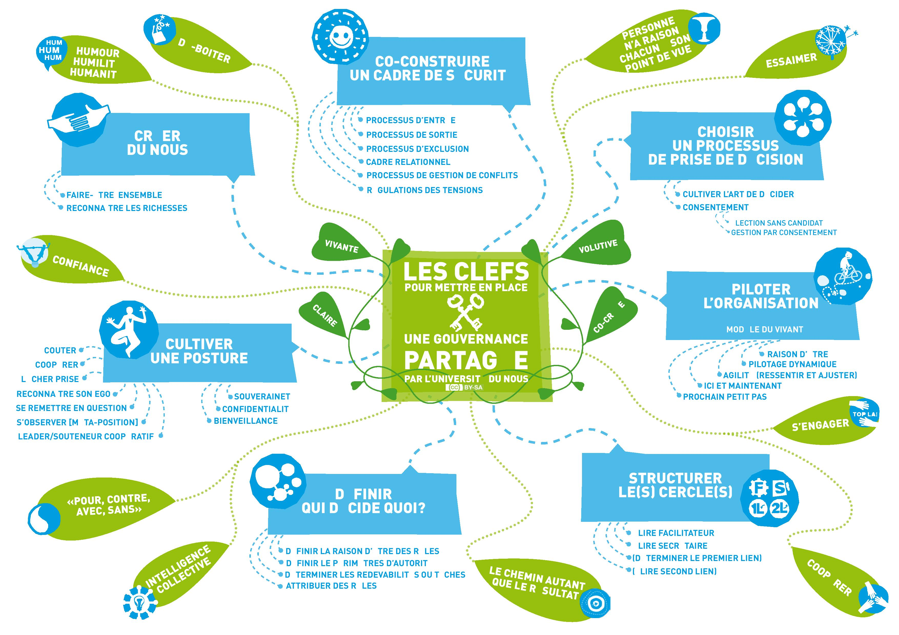

# Gourvernance partagée  

La première question à se poser est : *Avons-nous la volonté de mettre en place une gouvernance partagée ?*  
Voulons-nous fontionner de manière horizontale en impliquant les différents acteurs et utilisateurs du lieu ?  
Chacun pourra choisir son niveau d'implication. Participer à des cercles en fonction de ses compétences ou affinitées, proposer des ateliers et/ou moments de partage de compétences ou tout simplement venir sur le lieu sans forcément avoir l'envie de s'investir dans la vie de ce dernier.  
L'**entraide, la bienveillance et l'envie de faire ensemble** seront primordiales dans la gestion au quotidien.  

## Qu'est-ce que la gouvernance partagée ?

Nous ferons ici référence à la définition du site de l'Université du nous.  

  

*Illustration issue du site http://universite-du-nous.org/*  

Dans un projet impliquant plusieurs personnes, la gouvernance est un des éléments clé pour se donner les moyens de réussir se qui nous a réuni. Construire dans la durée nécessite une attention toute particulière à penser etorganiser notre "Faire ensemble".  
Définir une gouvernance partagée, c'est définir les relations et les processus de prises de décisions.
En d'autres termes, et toujours en reprenant les termes de l'Université du Nous, la gouvernance partagée c'est l'ensemble des règles de fonctionnement relationnels et organisationnels.  

Il existe énormément d'outils permettant d'expérimenter et de mettre en place une gouvernance partagée. On pourrait citer par exemple les outils d'intelligence collective, une gestion par consentement, une élection sans candidat, ...  

## Les différentes briques d'une gouvernance partagée  
(source : https://nos-communes.fr/gouvernance/introduction-a-la-gouvernance-partagee/)  

* **Un “Nous” fort :**  
Pas de Gouvernance Partagée sans un collectif soudé.

* **Des individus souverains :**  
De la même manière, il ne peut y avoir de “Nous” fort sans des “Je” convaincus de leur légitimité au pouvoir. Bien sûr, on ne parle pas ici de pouvoir “sur”, mais de pouvoir “avec”.  
Des rôles clairs et bien délimités : Mais comme évoqué plus haut, tout le monde ne décide pas de tout. Les tâches à accomplir et les décisions à prendre sont regroupées sous forme de rôles qui ont chacun un périmètre de responsabilités très clair et explicite. Ce périmètre est le cadre au sein duquel l’individu qui exerce le rôle a pleine autorité. Ce n’est qu’à la jonction entre plusieurs rôles que la co-décision entre en jeu.  

* **Des process qui neutralisent les égos :**  
Dans le cadre d’une co-décision — une élection par exemple — l’équivalence de pouvoir entre chaque membre est cruciale. Du tour de parole ouvert au principe de non-objection, en passant par la présence d’un facilitateur vigilant, la Gouvernance Partagée propose divers outils voués à libérer la parole, à neutraliser les jeux d’influence, et à protéger l’équipe de dangereux raccourcis. Certes, utiliser ces outils demande du temps, mais moins que l’apaisement à postériori des tensions générées par une décision mal prise.  

* **Un pilotage par tensions :**  
Une tension est un frottement vécu par un membre dans l’exercice de son rôle, ou dans la rencontre entre plusieurs rôles. En bon système vivant, l’organisation en Gouvernance Partagée considère que les tensions sont un guide vers son état optimal.  

* **Une structure en cercles articulés par des double liens :**  
l’organisation sera scindée en cercles — des petites équipes — qui auront tous leur raison d’être et leur périmètre de responsabilités.   Leur coordination, elle, repose sur deux représentants [ou “liens”] par cercle qui, présents et souverains aux réunions des cercles connexes, assureront la circulation ascendante, descendante et éventuellement horizontale du pouvoir.

[Retour](README.md)
