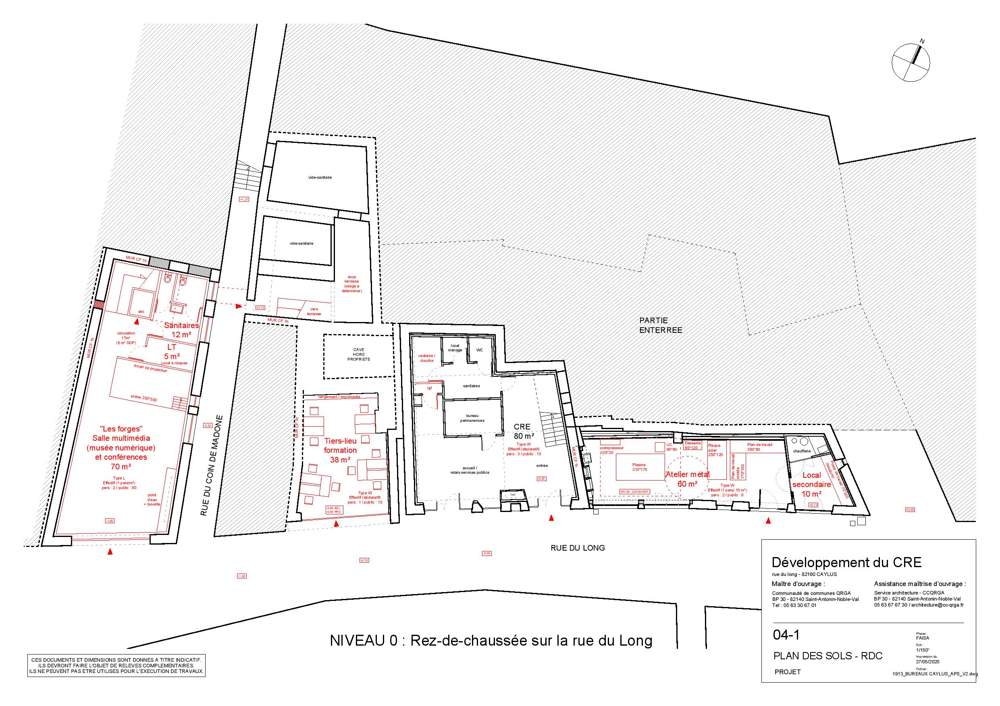
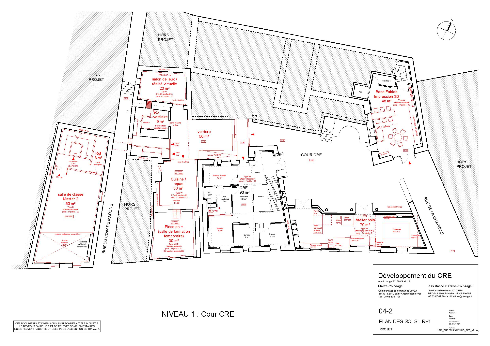
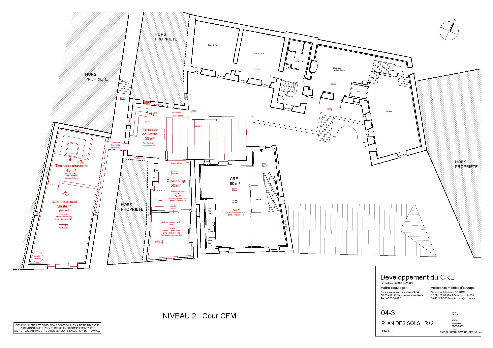
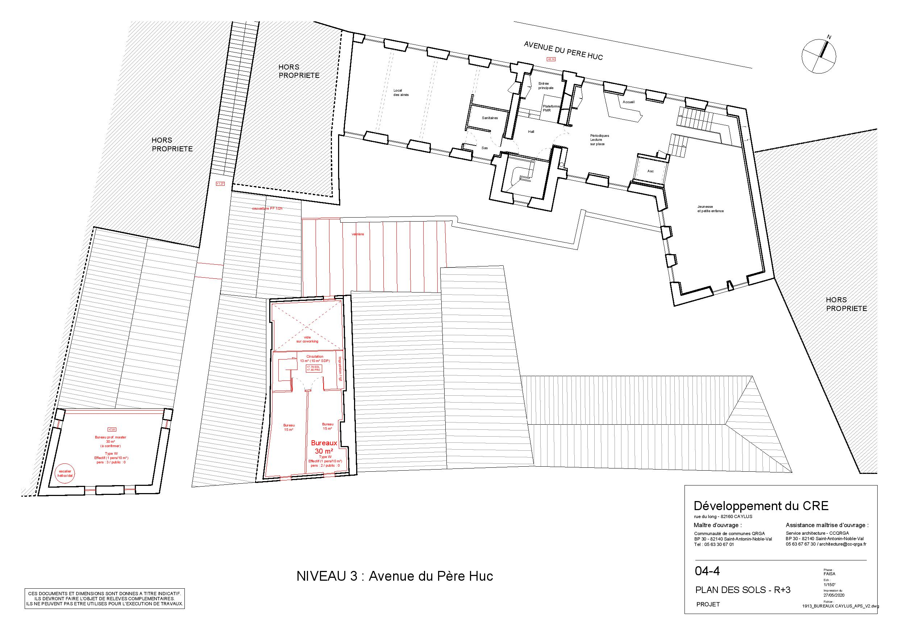
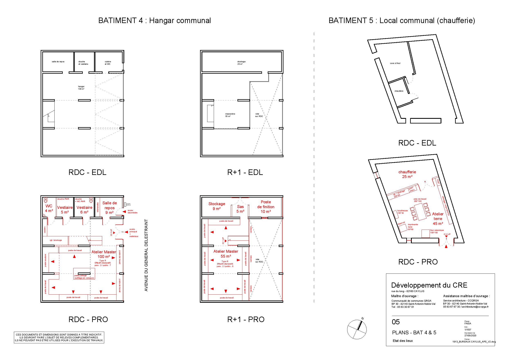

# 4. Description de l'offre de services  

## 4.1 Publics cibles  

Le public cible est large et hétérogène. Le Tiers-Lieu est un espace ouvert à toutes personnes cherchant un lieu où travailler, échanger, créer, fabriquer, réparer des objets ou encore innover. Que ce soit à titre professionnel ou personnel, le Tiers-Lieu est l'endroit idéal pour se rencontrer, créer du lien, faire réseau, s'impliquer dans un projet collectif ou tout simplement venir passer un moment avec son voisin. C'est également un lieu où l'apprentissage, l'expérimentation et le faire-ensemble est encouragé.

### 4.1.1 Les jeunes  
Des activités avec des jeunes du territoire ont déjà eu lieu. Notre volonté est de continuer à accueillir et accompagner les jeunes dans l'exploration et l'utilisation de tous ces outils et aussi dans la découverte de nouveaux modes de travail, d'échanges, de vie en société.

### 4.1.2 Les professionnels  
Les salariés en télétravail, les indépendants, les personnes en recherche d'emploi, les créateurs d'entreprise trouveront sur le lieu l'aide nécessaire au démarrage de leur société, des conseils, des outils de fabrication, des espaces de réunion...  
Des rencontres entre entrepreneurs seront organisés afin de faire de la mise en réseau, d'acquérir de nouvelles compétences, d'échanger et de partager des bonnes pratiques.  

### 4.1.3 Les associations  
Des associations pourront venir profiter des espaces offerts par le lieu afin de bénéficier de salles, d'outils spécifiques ou encore venir présenter leurs projets.

---  

## 4.2 Description de l'offre  

Le Tiers-Lieu sera ouvert au minimum du lundi au vendredi de 8h30 à 17h30 avec deux nocturnes, les mardi et jeudi jusqu'à 22h. Des week-ends avec des rencontres thématiques seront proposés ou l'accès à la Micro-Folie sera possible. Les résidents auront un accès au lieu 24/7 au lieu.  
Le lieu est équipé d'une connexion internet haut débit et pourra prochainement être équipé de la fibre optique autorisant un débit bien supérieur. Seront accessibles des salles de réunions équipées pour de la visio-conférence, des espaces de coworking, des bureaux, des espaces conviviaux, une cuisine partagée, des jardinières, un fablab avec différents ateliers (bois, métal, terre), une médiathèque, un espace micro-folie et des espaces de formation. 
Nous détaillerons ci-dessous de manière plus précise l'offre des différents espaces.  

### 4.2.1 Salle de réunion  
Une salle de réunion d'environ 25m² pouvant accueillir 12 participants au maximum équipée d'une connexion internet filaire et sans-fil, d'un système de visio-conférence avec caméra, écran géant et micro individuel. La salle de réunion sera accessible aux résidents permanents du Tiers-Lieu mais également aux extérieurs comme des associations pour la tenue de leur Conseil d'Administration par exemple, des municipalités, des entreprises, les écoles, ... Au niveau du mobilier, la salle sera équipée de tables et de chaises que l’on pourra reconfigurer en fonction du nombre des besoins ou du nombre de personnes et de rangements/casiers.   

### 4.2.2 Bureaux  
6 bureaux allant de 10 à 15m², fermés, seront disponibles au mois ou à l'année. Un bureau sera réservé pour les personnes souhaitant louer un espace pour un temps réduit (une journée ou plus) et un autre pourra être attribué à l’équipe du fablab. Chacun est équipé d'une armoire, d’un ensemble bureau/chaise, étagère, d'une connexion internet et bénéficie de l'accès à un photocopieur. Chaque locataire bénéficie bien entendu de l'accès à l'ensemble des espaces.  

### 4.2.3 Espaces de coworking  
Un espace de coworking de 25m² pouvant accueillir 4 personnes maximum équipé de bureau et de casier, d'une connexion wifi, d'un accès au photocopieur, aux espaces de repos et à la cuisine partagée. L'accès à la journée sera facturé 5€. Ce prix comprend une dizaine d'impressions ou photocopies. Les suivantes seront facturées.  

### 4.2.4 Fablab  
Le fablab mettra à disposition de tous un atelier bois et métal de respectivement 70 et 60m². L'atelier bois sera équipé d'une fraiseuse numérique de grande taille ainsi que de deux découpes laser de grande et moyenne taille. L'atelier métal quant à lui offrira l'accès à une découpe plasma et des outils pour travailler le métal. Un espace de plus de 40m² équipé de tables et chaises offrira l'accès aux imprimantes 3D, découpe vinyle et fil chaud ainsi qu'un espace détente et documentation avec un coin canapé. D'autres espaces, restant à définir, permettront d'accueillir des zones d'assemblages, un laboratoire d'électronique ou encore un atelier terreD'autres espaces, permettront d'accueillir des zones d'assemblages, un laboratoire d'électronique ou encore un atelier terre de 45m² équipé de plan de travail, zone de séchage, ...    

### 4.2.5 Salle multimédia et conférences    
L'installation d'une Micro-folie est prévue sur le lieu. Un espace de 70m² pour le musée numérique, avec un mur d’écran et une bonne sonorisation, que viendra compléter un espace de réalité virtuelle/salon de jeux de 20m². La Micro-folie sera un outil d'accès à l'art pour tous et des ateliers viendront compléter ce dispositif en partenariat avec des structures du territoire comme la résidence d'artiste Draw International ou encore l'Abbaye de Beaulieu, abbaye cistercienne abandonnée à la Révolution, sauvée de la ruine dans les années 1950 par Geneviève Bonnefoi et Pierre Brache. En 1973, ils en font don ainsi qu'une importante collection d'art moderne aux Monuments nationaux. L'abbaye est alors transformée en centre d'art contemporain et aujourd'hui plus important musée d'art contemporain de la région Midi-Pyrénées. Pour le musée numérique, du mobilier et matériel spécifique sera acheté (pupitres, tablettes, poufs, casques audio). L'espace « Les forges » pourra accueillir d'autres événements comme des conférences, des réunions. Il sera modulaire et facilement reconfigurable en fonction des besoins. Il proposera un espace scénique qui permettra d'accueillir des troupes de théâtres ou encore des groupes de musique ainsi qu’un espace buvette avec un point d’eau. Il sera visible depuis l'extérieur et se trouvera à un carrefour stratégique du village. A la croisée de la rue menant à la place principale du village, du Tiers-Lieu et de l'accès au lac de Labarthe et situé à proximité de l'office de tourisme il pourra également servir pour l'accueil des touristes.  

### 4.2.6 Formation  
Une salle de formation d’environ 40m² et capable d'accueillir jusqu'à 10 stagiaires, labellisée Tiers-Lieu eFormation a été créée en Mars 2019.  
A cela, viendra se greffer le projet de création d'un master Artisan Numérique, prenant la suite de la Licence Pro déjà existante en partenariat avec la Chambre des Métiers et de l'Artisanat de Tarn-et-Garonne. Deux salles de classe, une de 50m² et l’autre de 65m², équipées avec des tables et chaises et des casiers, ainsi qu'un atelier de plus de 100m² équipé de plans de travail, vestiaires et salle de repos permettra à 40 élèves de suivre ce master au sein du Tiers-Lieu, d'accéder par la même occasion aux différents espaces et d'être mêlé à des publics très variés dont des professionnels. Le fait de faire se côtoyer des étudiants et des professionnels sera bénéfiques pour toutes les parties. 

### 4.2.7 Médiathèque  
La médiathèque de Caylus s'étend sur environ 200m² et propose un grand catalogue et varié. Situé en plein coeur du Tiers-Lieu elle permettra de se documenter sur place ou d'emprunter des livres. Véritable lieu d'échange et de partage elle vient compléter un environnement déjà riche.  

### 4.2.8 Espaces communs  

#### a. Cuisine/verrière  
Une cuisine partagée de 30m² permettra aux personnes fréquentant le lieu de pouvoir se restaurer sur place.  
Une verrière d'environ 50m² assurera une liaison abritée entre plusieurs bâtiments et pourra être utilisée lors de réception ou événements organisés au sein du lieu. Du mobilier sera installé au sein de cette dernière.   

#### b. Vestiaires / sanitaires
Afin d'encourager l'usage du vélo ou la pratique du sport, il est envisagé d'installer des vestiaires avec des douches et des casiers au sein du lieu. Le Tiers-lieu étant amené à accueillir toujours plus de personnes, il est nécessaire de rajouter des sanitaires.  

#### c. Terrasses  
Des terrasses extérieures, couvertes ou non, pourront être utilisées par tout un chacun. Ces espaces seront aménagés avec des mange-debout, des chaises, canapés, ...  

#### d. Pièce en plus
Une pièce supplémentaire, située derrière la cuisine, servira de salle de formation temporaire durant la phase 2 des travaux et pourra, par la suite, servir de salle de réunion, d’extension de la cuisine pour des ateliers de pâtisserie par exemple, …

### 4.3 Plans  

  

	  

  

  

  

---  

## 4.4 Programmation, événementiels  

### 4.4.1 Animations régulières  

#### a. Café Bricol'  
Le café Bricol' est un rendez-vous mensuel ayant lieu le mardi de 18h à 22h. Lors de ce rendez-vous, nous essaierons ensemble de réparer divers appareils électroménagers, électroportatifs, ...  
Il s'appuie sur la communauté du lieu ainsi que sur les animateurs du fablab.  
Il est l'occasion de sensibiliser à la réparation, au recyclage et au ré emploi.  
Des trocs de matériel pourront être organisés lors de ces soirées.   

#### b. Atelier Low Tech  
Faire simple. Faire mieux avec moins. Penser recyclage, ré emploi.  
Tels sont quelques idées derrière le terme Low Tech.  
Comme pour les cafés Bricol', l'Atelier Low Tech est un rendez-vous mensuel ayant lieu tous les 2èmes mardis de chaque mois de 18h à 22h.  
Des projets en lien avec l'habitat, l'alimentation, le transport ou encore l'énergie seront développés et des expérimentations menées.  
Pour mener à bien ces projets la communauté pourra s'appuyer sur les outils du fablab et les différents espaces à disposition.  
Exemples de projet déjà réalisés : Un four Tandoori en terre paille, une éolienne à base de moteur d'hoverboard ou encore un vélo électrique toujours à base de moteur d'hoverboard.  
Parallèlement à ces rendez-vous sera mis en place une bricothèque permettant d’emprunter du matériel de bricolage.

#### c. Open Lab  
Evénement régulier ayant lieu tous les 4èmes samedis de chaque mois. Des thématiques très différentes seront abordées lors de ces journées allant de journées jeux ou d'expositions d'art en passant par de la Musique assistée par Ordinateur ou encore de fabrication de mobilier en palettes ou de découvertes des machines de fabrication numérique. Ces événements sont gratuits et ouverts à tous. Ils pourront être coorganisés avec d'autres associations et parfois en dehors des murs du lieu.  

#### d. BarCamp  
Un BarCamp est une rencontre, une non-conférence ouverte, qui prend la forme d'ateliers-événements participatifs où le contenu est fourni par des participants qui doivent tous, à un titre ou à un autre, apporter quelque chose au Barcamp.  
C'est le principe « pas de spectateur », « tous participants ». L'événement met l'accent sur les toutes dernières innovations en matière d'applications Internet, de logiciels libres et de réseaux sociaux.  

#### e. Rencontres thématiques  
Ces rencontres auront lieu une fois par trimestre et permettront à la fois de partager des informations et de créer une véritable dynamique à l'échelle du territoire en permettant, tant aux habitants qu'aux professionnels, de se rencontrer et de discuter autour de projets ou de faire remonter des besoins/des envies en donnant la parole à chaque personne qui en exprimerait le désir.  

#### f. Ateliers culinaires  
Véritable moment de convivialité, de partage et d'apprentissage, des ateliers culinaires et de pâtisseries solidaires pourront être organisés dans la salle derrière la cuisine.  

### 4.4.2 Animations ponctuelles  

Sur le lieu pourront se tenir des événements portés par les utilisateurs du lieu en fonction de leurs envies, leurs besoins.  
Des espaces pourront également être privatisés pour l'organisation d'événements privés tels que des événements d'entreprise par exemple.  
Au besoin, et à la demande des coworkers par exemples, des permanences d'experts comptables, d'avocats ou juristes pourront être organisées sur le temps du midi.  

[Retour](README.md)
